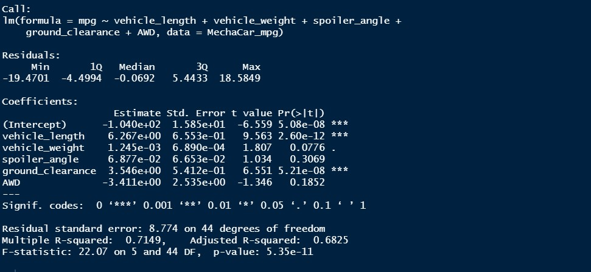
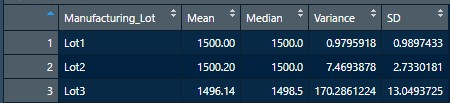
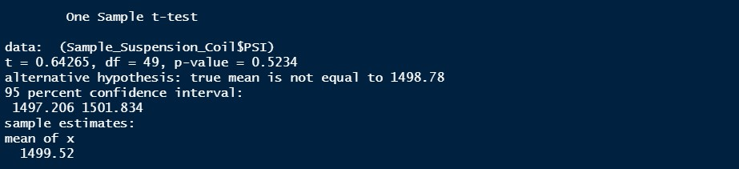
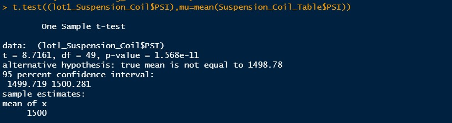
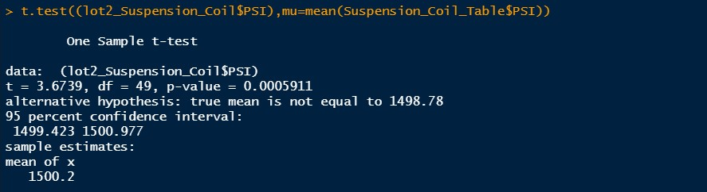
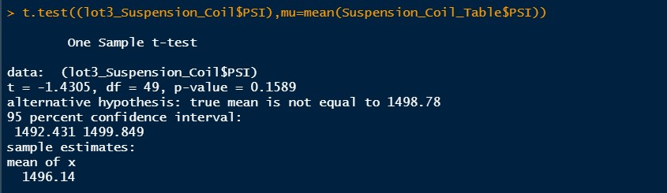

# MechaCar_Statistical_Analysis
Module 15

## Linear Regression to Predict MPG

**Which variables/coefficients provided a non-random amount of variance to the mpg values in the dataset?**\
\
According to our results, the variables that provided vehicle_length and ground_cleareance (as well as intercept) are statistically unlikely to provide random amounts of variance to the linear model as evidence by the low p-value of these variables. Meaning that these variables have significant impact in the mpg of the MechaCar.

**Is the slope of the linear model considered to be zero? Why or why not?**\
\
The slope of the linear model is not considered to be zero, there is a relationship between the variables and the MechaCar mpg, as evidence by the Pearson correlation coefficient's r-value of 0.7149 there is strong positive correlation between our variables.

**Does this linear model predict mpg of MechaCar prototypes effectively? Why or why not?**\
\
Based on the previous two answers a linear model can effectively predict mpg of MechaCar prototypes.

## Summary Statistics on Suspension Coils

In this section we need to use statistical analysis to determine if the manufacturing process is consistent across production lots. Looking at table 2.1 the total summary for all production lots we see the variance is withing the design specifications dictated, and the variance does not exceed the 100 pounds per square inch. Once we look at the summary of each individual lot (Table 2.2), we not that the variance of lot 3 is above the specified parameters with a variance of 170.3, meaning the suspension coils from lot 3 does not meet the design specifications.

**Table 2.1: Total Summary**\

**Table 2.2: Lot Summary**\

## T-Tests on Suspension Coils

According to the results from out T-Test for all lots the p-value is 0.5234 which is higher than our significant level of 0.05, therefore there is not enough evidence to reject the null hypothesis, so there is no statistical difference between the sample population and the population mean.\
The p-value for lot 1 a 2 are very low and we will have to reject the null hypothesis based on these results, for lot 3 we cannot reject the null hypothesis.

**T-Test for all lots**\

**T-Test for lot 1**\

**T-Test for lot 2**\

**T-Test for lot 3**\

## Study Design: MechaCar vs Competition

To study our car design vs the competition we could compare our MechaCar MPG to Weight Ratio vs the competitions models to determine how efficient our prototype is based on its design. To be able to perform this study we need to gather vehicle weight and mpg data from our competition vehicles, compare it to the weight and mpg of out prototype.
We will set out hypothesis as:

**Null Hypothesis**: No changes on out vehicle design (spoiler, height, engine size) will result on a significant difference in the MPG of our vehicle compared to the competition at a similar weight.

**Alternative Hypothesis**: Changes in the vehicles design result and significant changes to the mpg performance at the same weight as out competitor vehicles.

to the this we will perform A/B testing on minor changes in design to the vehicle and its impact on the mpg, and compare it to the mpg of the competitors vehicles at the same weight.

